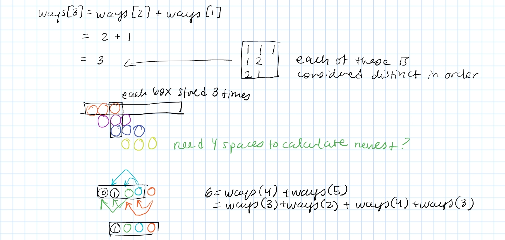

## Problem

You are climbing a staircase. It takes n steps to reach the top.

Each time you can either climb 1 or 2 steps. In how many distinct ways can you climb to the top?

## Solution

This is a dynamic programming problem where we can use previous steps to inform our solution at step `i`. 
In this case, we can combine the distinct solutions from steps `i-1` and step `i-2`. 
This symbolizes the decision we make to climb either 1 or 2 steps.

**Optimization:**

At step `i`, the only information we need is from step `i-1` and step `i`. This means that we can swap between three integers to iteratively construct a solution for step `n`.

